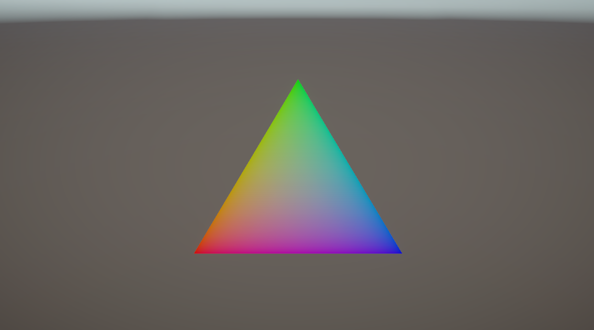
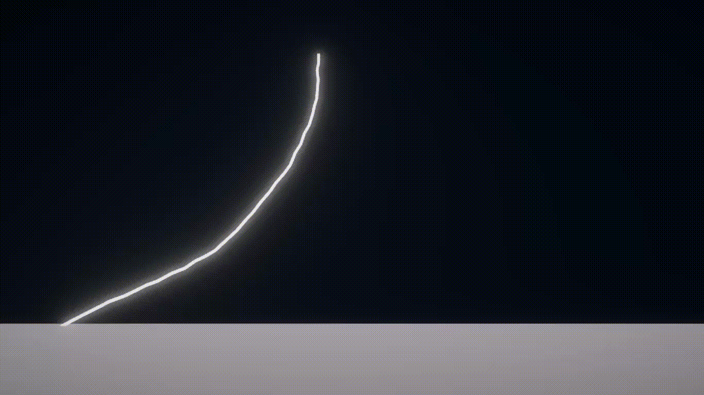
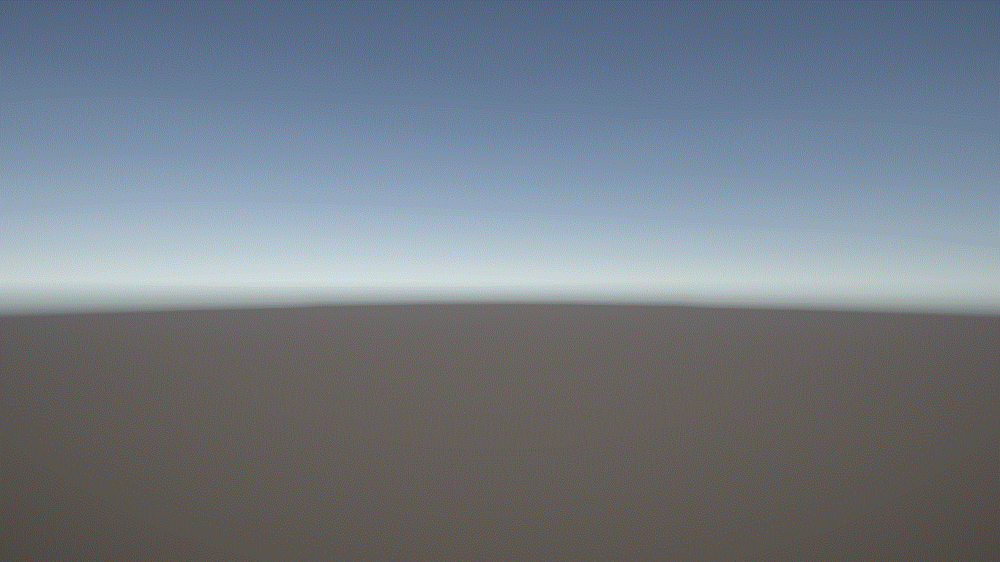

# 雷
雷を使ってみよう

## 結果画像

## 自分なりにかっこいいシーン

# 自分なりに変更した点
-
-
-

# 進め方

- 本リポジトリをフォークしてください
- フォークしたリポジトリをcloneします
- Unityのプロジェクトを更新して実装してください。
  - 結果画像1（一番上の画像）と同じシーンを「1 Polygon Scene」に実現してください
  - 結果画像2（二番目の画像）と同じシーンを「2 Random Walk Scene」に実現してください
  - 自分なりにかっこいいシーンを「My Best Scene」に作成してください
- 「My Best Scene」の結果をUnity Recorder等で動画として保存し、result.gifと差し替えてください（サイズが大きくて上げられない場合は、解像度を小さくするなどしてください）
- このテキストファイルに変更点を記載してください
- プルリクエストを出して提出してください
